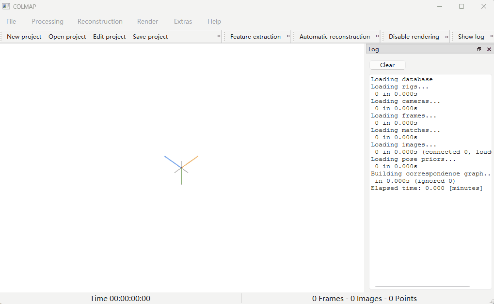

# Assignment 3 - Bundle Adjustment and COLMAP Reconstruction

This repository is an implementation summary for DIP Assignment 3. The assignment contains two parts:

1. Implement Bundle Adjustment from scratch using PyTorch.
2. Use COLMAP to reconstruct a 3D model from multi-view images.

The dataset contains 50 rendered views of a 3D head model. For Task 1, the provided 2D observations have known cross-view point correspondences. For Task 2, COLMAP starts only from the rendered images and automatically estimates feature matches, camera poses, sparse structure, and dense point clouds.


## Requirements

To install Python requirements:

```setup
python -m pip install -r requirements.txt
```

The Python dependencies are mainly used for Task 1 optimization and visualization:

- `numpy`
- `torch`
- `matplotlib`
- `opencv-python`

Task 2 also requires COLMAP. On Windows, download and unzip the COLMAP CUDA package. In this project, the tested COLMAP folder is:

```text
C:\Users\Administrator\Downloads\colmap-x64-windows-cuda
```

If COLMAP is not added to `PATH`, the PowerShell script can still locate this default path automatically, or you can pass it manually with `-ColmapPath`.


## Running of Task1

### Task 1: PyTorch Bundle Adjustment

Run the full Bundle Adjustment optimization:

```basic
python bundle_adjustment.py --device cpu --iters 3000
```

If CUDA is available for PyTorch:

```basic
python bundle_adjustment.py --device cuda --iters 3000
```

For a quick smoke test:

```basic
python bundle_adjustment.py --iters 5 --view-batch-size 10
```

The output files are saved to:

```text
outputs/task1/
├── reconstruction.obj          # colored reconstructed point cloud
├── loss_curve.png              # optimization loss curve
└── optimized_parameters.npz    # optimized 3D points, camera poses, focal length, losses
```

## Key Technical Details of Task1

### Task 1: Bundle Adjustment from 2D Observations

Task 1 solves a classical Bundle Adjustment problem. The input file `data/points2d.npz` contains 50 views. Each view stores 20000 rows in the form:

$$
(x_{ij}, y_{ij}, m_{ij})
$$

where $i$ is the view index, $j$ is the point index, and $m_{ij}$ is the visibility flag. If $m_{ij}=1$, point $j$ is visible in view $i$; otherwise the observation is ignored in the loss.

The goal is to optimize:

1. A shared focal length $f$.
2. Per-view camera extrinsics $(R_i, T_i)$.
3. All 3D point coordinates $P_j = [X_j, Y_j, Z_j]^T$.

#### 1. Camera projection model

For each camera view, a 3D point in world coordinates is first transformed into the camera coordinate system:

$$
P_{ij}^{c} =
\begin{bmatrix}
X_{ij}^{c} \\
Y_{ij}^{c} \\
Z_{ij}^{c}
\end{bmatrix}
= R_i P_j + T_i
$$

The image size is $1024 \times 1024$, so the principal point is:

$$
c_x = c_y = 512
$$

Following the coordinate convention of this assignment, the projection function is:

$$
u_{ij} = -f \frac{X_{ij}^{c}}{Z_{ij}^{c}} + c_x
$$

$$
v_{ij} = f \frac{Y_{ij}^{c}}{Z_{ij}^{c}} + c_y
$$

The negative sign in the horizontal direction is caused by the assignment's camera convention: the object lies in front of the camera with negative camera-space depth, so the sign is adjusted to avoid horizontal flipping.

#### 2. Rotation parameterization

Directly optimizing a $3 \times 3$ rotation matrix is inconvenient because a valid rotation matrix must satisfy:

$$
R^T R = I,\quad \det(R)=1
$$

Therefore, the implementation optimizes three Euler angles for each view:

$$
\theta_i = [\alpha_i, \beta_i, \gamma_i]
$$

The rotation matrix is constructed as:

$$
R_i = R_x(\alpha_i) R_y(\beta_i) R_z(\gamma_i)
$$

This keeps the number of rotation parameters small and allows PyTorch autograd to optimize them directly.

#### 3. Reprojection loss

The predicted 2D position of point $j$ in view $i$ is:

$$
\hat{p}_{ij} =
\pi(R_i P_j + T_i, f)=
\begin{bmatrix}
u_{ij} \\
v_{ij}
\end{bmatrix}
$$

The observed 2D point is:

$$
p_{ij} =
\begin{bmatrix}
x_{ij} \\
y_{ij}
\end{bmatrix}
$$

The Bundle Adjustment objective minimizes the reprojection error over all visible observations:

$$
\min_{f,\{R_i,T_i\},\{P_j\}}
\sum_i \sum_j
m_{ij}
\left\|
\pi(R_i P_j + T_i, f) - p_{ij}
\right\|^2
$$


## Results of Task1

### Task 1 - Bundle Adjustment Point Cloud


The animation shows the colored 3D point cloud reconstructed by the PyTorch Bundle Adjustment implementation.


## Running of Task2
### Task 2: COLMAP Reconstruction

On Windows PowerShell, run the full COLMAP pipeline:

```basic
.\run_colmap.ps1 -UseGpu -Clean
```


The COLMAP outputs are saved to:

```text
data/colmap/
├── sparse/0/           # sparse SfM model: cameras, registered images, sparse 3D points
└── dense/fused.ply     # dense fused point cloud
```

To open the COLMAP GUI on Windows without setting `PATH`:

```basic
& "C:\Users\Administrator\Downloads\colmap-x64-windows-cuda\COLMAP.bat" gui
```

The sparse model can be imported from:

```text
data/colmap/sparse/0/
```

The dense point cloud can be viewed with MeshLab, CloudCompare, or Open3D:

```text
data/colmap/dense/fused.ply
```

## Key Technical Details of Task2
### Task 2: COLMAP SfM and MVS Reconstruction

Task 2 uses COLMAP to perform a complete image-based 3D reconstruction pipeline. Unlike Task 1, COLMAP does not use the provided `points2d.npz` correspondences. It starts only from the 50 rendered images in `data/images/`.

The pipeline in `run_colmap.ps1` and `run_colmap.sh` contains the following steps.

#### 1. Feature extraction

COLMAP detects local image features in every input image. In the default setting, SIFT-like features are used. Each feature contains a 2D location and a descriptor:

$$
\mathbf{x}_{ik} = [u_{ik}, v_{ik}]^T
$$

$$
\mathbf{d}_{ik} \in \mathbb{R}^{128}
$$

The descriptor encodes local image appearance and is used for matching features between different images.

#### 2. Feature matching and geometric verification

COLMAP compares descriptors between image pairs and proposes feature matches:

$$
\mathbf{x}_{ik} \leftrightarrow \mathbf{x}_{jl}
$$

Raw descriptor matches may contain incorrect correspondences, so COLMAP uses geometric verification. For two views, corresponding points must satisfy the epipolar constraint:

$$
\mathbf{x}_j^T F \mathbf{x}_i = 0
$$

where $F$ is the fundamental matrix. If camera intrinsics are known or estimated, the relation can also be expressed with the essential matrix:

$$
\mathbf{x}_j^T E \mathbf{x}_i = 0
$$

RANSAC is used to robustly estimate the two-view geometry and reject outliers.

#### 3. Sparse reconstruction with Structure-from-Motion

After verified matches are found, COLMAP incrementally estimates camera poses and sparse 3D points. A camera projection matrix can be written as:

$$
P_i = K_i [R_i \mid t_i]
$$

where $K_i$ is the camera intrinsic matrix, and $(R_i,t_i)$ are the camera extrinsics.

Given matched 2D observations across multiple views, a 3D point $X_j$ can be triangulated by solving:

$$
\mathbf{x}_{ij} \sim P_i X_j
$$

for all views where the point is observed.

COLMAP then applies Bundle Adjustment internally:

$$
\min_{\{K_i,R_i,t_i\},\{X_j\}}
\sum_{i,j}
\left\|
\pi(K_i,R_i,t_i,X_j) - \mathbf{x}_{ij}
\right\|^2
$$

## Results of Task2

### Task 2 - COLMAP Sparse Reconstruction



The animation shows the sparse SfM reconstruction produced by COLMAP, including recovered camera poses and sparse 3D points.


### Task 2 - COLMAP Dense Reconstruction


The animation shows the dense point cloud reconstructed by COLMAP Multi-View Stereo and stereo fusion.


## Acknowledgement

This assignment refers to the classical theory of Bundle Adjustment, Structure-from-Motion, and Multi-View Stereo.

**References**

- Bundle Adjustment: <https://en.wikipedia.org/wiki/Bundle_adjustment>
- PyTorch optimization: <https://pytorch.org/docs/stable/optim.html>
- COLMAP documentation: <https://colmap.github.io/>
- COLMAP tutorial: <https://colmap.github.io/tutorial.html>
